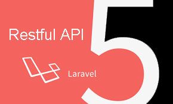
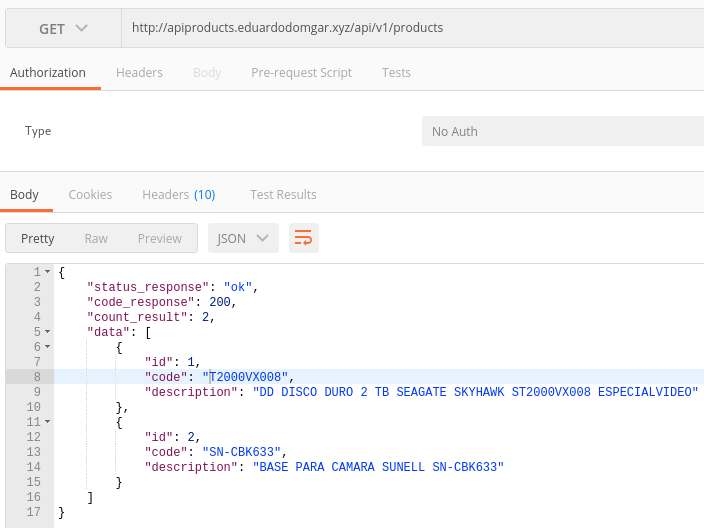
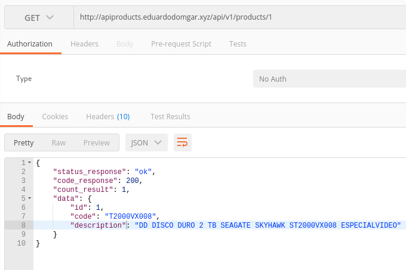
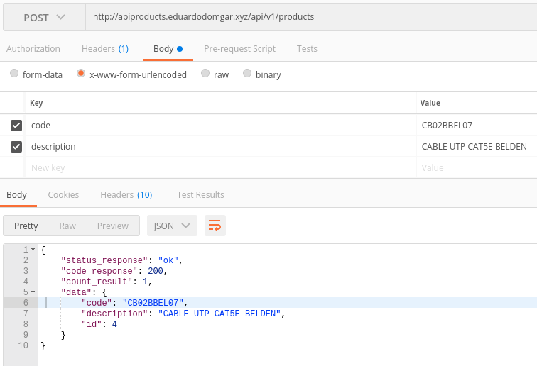
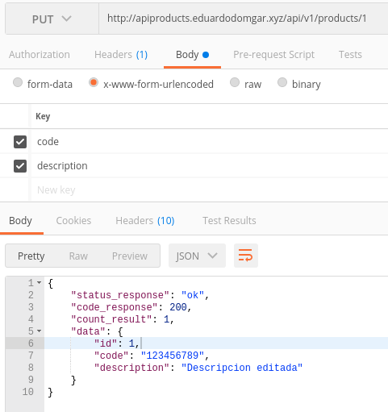
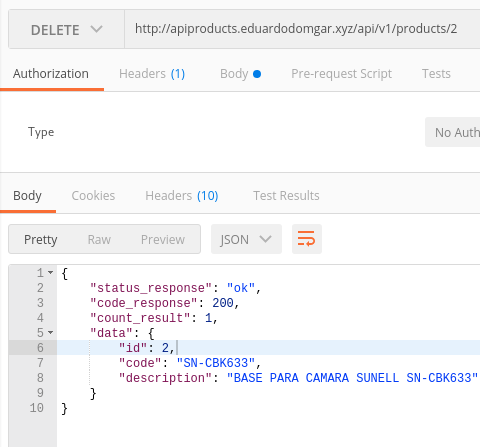

## Acerca de API Products

Primero, necesitamos entender qué es exactamente lo que se considera una API RESTful. REST significa REpresentational State Transfer y es un estilo arquitectónico para la comunicación en red entre aplicaciones, que se basa en un protocolo sin estado (normalmente HTTP) para la interacción.

## Los verbos HTTP representan acciones

En las API RESTful, usamos los verbos HTTP como acciones y los puntos finales son los recursos a los que se ha actuado. Estaremos utilizando los verbos HTTP para su significado semántico:

- GET: recuperar recursos
- POST: crear recursos
- PUT: actualiza recursos
- DELETE: elimina recursos

## Información adicional
Los recursos que se pueden encontrar:
- Database: Seeding
- Using Model Factories
- Eloquent
- Soft Deleting
- Database: Migrations
- Routing: apiResource
- JSON Responses
- JSON Responses Exception
- Validation Laravel
- Model Product tabla = products con atributos code y description
- Modificación del Kernel para 50 peticiones por minuto
- Traduccion en español de la validaciones

## Enlaces de prueba
- **[Recuperar todos los productos en formato JSON](http://apiproducts.eduardodomgar.xyz/api/v1/products)**
- **[Recuperar un producto por medio de su ID en formato JSON](http://apiproducts.eduardodomgar.xyz/api/v1/products/1)**
- Para la creación de un producto se tiene que enviar por el metodo POST a la url http://apiproducts.eduardodomgar.xyz/api/v1/products
Acepta dos parametros code y description los cuales aplica validaciones como que el código no sea mayor a 10 digitos y que estos valores no vengan vacios.
- Para la edicion del producto se debe de hacer por el metodo PUT http://apiproducts.eduardodomgar.xyz/api/v1/products/?id_del_producto
Acepta dos parametros code y description los cuales aplica validaciones como que el código no sea mayor a 10 digitos y que estos valores no vengan vacios.
- Para la eliminación del producto se debe de hacer por el metodo DELETE http://apiproducts.eduardodomgar.xyz/api/v1/products/?id_del_producto
Con el ID del poducto al final de la url para realizar un soft delete en la base de datos.

## Imagenes de muestra de los procesos con la herramienta de POSTMAN

